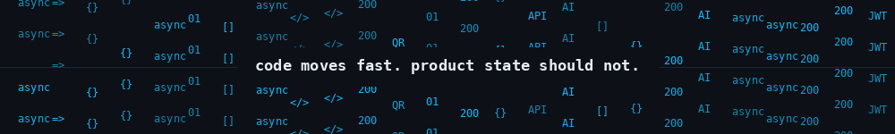
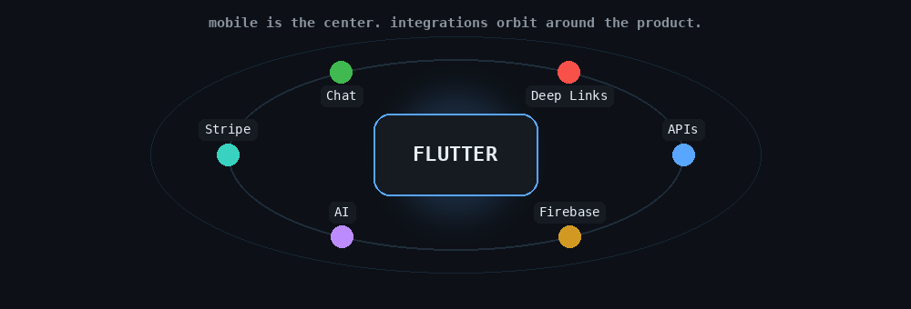
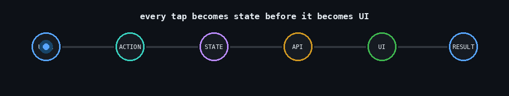
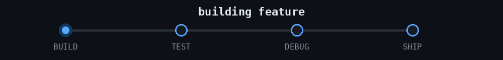
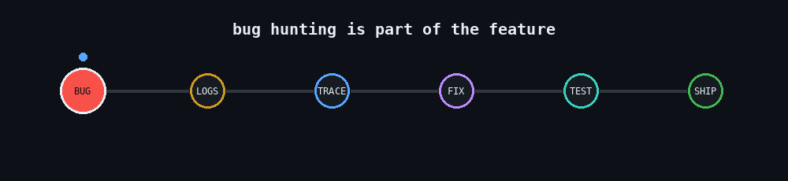
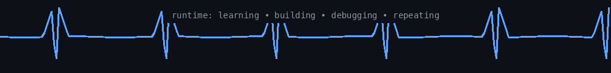

<!--
  GitHub Profile README
  Nazmul Islam
  ------------------------------------------------------------
  Built to feel like a developer profile, not a landing page.
-->

 

  

 

<table>
<tr>
<td width="33%" align="center">

<b>BUILD</b> 
Production mobile apps

</td>
<td width="33%" align="center">

<b>SOLVE</b> 
State, auth, payments & edge cases

</td>
<td width="33%" align="center">

<b>EXPLORE</b> 
AI + mobile workflows

</td>
</tr>
</table>

~/hello

$ whoami

role        Flutter Developer
focus       Production mobile applications
working_on  Product flows, APIs, realtime features, payments, AI integrations
learning    AI / ML
status      Still debugging things that "should definitely work"

I like the part of mobile development that usually starts after the UI is already on screen.

A requirement can look simple until authentication behaves differently on iOS, a booking touches five states, a deep link has to survive app installation, an AI response needs to become reliable UI data, or a payment can no longer be treated as a single boolean.

That is the kind of work I enjoy.

  

~/stack --active

Mobile Development

<table>
<tr>
<td align="center" width="120">
   
  <b>Flutter</b>
</td>
<td align="center" width="120">
   
  <b>Dart</b>
</td>
<td align="center" width="120">
   
  <b>Android</b>
</td>
<td align="center" width="120">
   
  <b>iOS</b>
</td>
</tr>
</table>

State & Local Data

<table>
<tr>
<td align="center" width="130">
   
  <b>GetX</b>
</td>
<td align="center" width="130">
   
  <b>Provider</b>
</td>
<td align="center" width="130">
   
  <b>SQLite</b>
</td>
<td align="center" width="130">
   
  <b>GetStorage</b>
</td>
</tr>
</table>

APIs, Backend Services & Payments

<table>
<tr>
<td align="center" width="130">
   
  <b>Firebase</b>
</td>
<td align="center" width="130">
   
  <b>REST APIs</b>
</td>
<td align="center" width="130">
   
  <b>JSON</b>
</td>
<td align="center" width="130">
   
  <b>Stripe</b>
</td>
</tr>
</table>

DevOps & Infrastructure

<table>
<tr>
<td align="center" width="115">
   
  <b>Git</b>
</td>
<td align="center" width="115">
   
  <b>GitHub</b>
</td>
<td align="center" width="115">
   
  <b>Docker</b>
</td>
<td align="center" width="115">
   
  <b>Nginx</b>
</td>
<td align="center" width="115">
   
  <b>Ubuntu</b>
</td>
</tr>
</table>

Product Integrations

<table>
<tr>
<td align="center" width="125">
   
  <b>QR Systems</b>
</td>
<td align="center" width="125">
   
  <b>Realtime Chat</b>
</td>
<td align="center" width="125">
   
  <b>Deep Linking</b>
</td>
<td align="center" width="125">
   
  <b>AI Integration</b>
</td>
<td align="center" width="125">
   
  <b>Notifications</b>
</td>
</tr>
</table>

 

  

~/selected-work

Most of my production work is client work, so the source code is private.
I would rather describe the engineering honestly than attach fake public repository links.

<table>
<tr>
<td width="50%" valign="top">

Chaizen

Anonymous social app

Floating bubble interactions, anonymous chat, and an identity problem that looked simple until iPhone made the first approach unreliable.

The early device-ID approach was not stable enough for persistent identity, so the authentication flow moved toward passkeys.

Worked around

Flutter Animations Passkeys Chat

 

<table>
<tr>
<td align="center">
  <a href="https://play.google.com/store/apps/details?id=app.chaizen">
    
     <b>Google Play</b>
  </a>
</td>
<td align="center">
  <a href="https://apps.apple.com/app/id6758223599">
    
     <b>App Store</b>
  </a>
</td>
</tr>
</table>

</td>

<td width="50%" valign="top">

Mojacares

Healthcare service platform

Patient and staff workflows connected with healthcare services, reports, recorded vitals, health scores, AI insights, and AI chat.

The interesting part was turning information from different health records into something understandable inside the patient experience.

Worked around

Flutter Healthcare AI Insights Patient Data

<!--
Mojacares Google Play button goes here once the exact Play Store URL/package ID is confirmed.
Use the same Icons8 Google Play icon style as Chaizen.
-->

</td>
</tr>

<tr>
<td width="50%" valign="top">

Mediscribe AI

AI-assisted clinical documentation

Doctors record a consultation and the processed conversation becomes a structured SOAP note:

Subjective → Objective → Assessment → Plan

The useful part was not voice recording itself. It was turning a normal conversation into structured information the doctor could review later.

Worked around

Flutter Audio AI Processing SOAP

</td>

<td width="50%" valign="top">

COOW

QR ownership & recovery platform

What initially looked like a QR scanner became a system connecting physical objects, owners, finders, products, companies, and permissions.

Lost mode, deep links, private messaging, reward negotiation, verification levels, and shared company QR access were all part of the product.

Worked around

Flutter QR Deep Linking Messaging Permissions

</td>
</tr>

<tr>
<td width="50%" valign="top">

Adventure Rentals

Sports vehicle rental marketplace

A rental is not one screen. It moves through a lifecycle:

request → approval → payment → pickup → rental → return

The app connected vehicle listings, renter/provider flows, chat, booking state, and Stripe payments around that lifecycle.

Worked around

Flutter Marketplace Stripe Chat

</td>

<td width="50%" valign="top">

Gaelic Football Fantasy

Team building & player management

I knew almost nothing about Gaelic football before this project, so part of the work was understanding the sport before translating the client's rules into product behavior.

Player budgets, positions, availability, injuries, performance, and prediction-related information all affected the team-building flow.

Worked around

Flutter Team Building Budget Logic Player State

</td>
</tr>
</table>

 

  

~/project-notes

<b>Chaizen — the bubble problem</b>

 

The floating bubbles could not all move in the same predictable direction.

I used controlled randomized offsets such as:

-35    0    +35

to introduce enough variation that the bubbles felt independent without making the animation system unnecessarily complicated.

<b>COOW — the QR code was only the beginning</b>

 

A scanned QR could represent a vehicle, a lost object, a product, or a company-managed resource.

So the real question was never just:

"Can the app scan this QR?"

It was:

"What should happen after this QR is scanned?"

That led into identity, permissions, deep links, lost mode, messaging, and company access.

<b>Adventure Rentals — state matters</b>

 

The booking had to remain understandable from both sides.

Renter                         Provider
  |                               |
  | -------- request -----------> |
  |                               |
  | <------- accept ------------- |
  |                               |
  | -------- payment -----------> |
  |                               |
  | -------- pickup ------------> |
  |                               |
  | -------- return ------------> |

The same booking existed for both users, but the actions available to each side were different.

~/how-i-build

  

 

idea
 │
 ▼
understand the real workflow
 │
 ▼
find hidden states + edge cases
 │
 ▼
decide what belongs to app / API
 │
 ▼
build
 │
 ▼
test on Android + iOS
 │
 ▼
something weird happens
 │
 ▼
debug the real cause
 │
 ▼
ship

My default questions are usually:

What happens if this request runs twice?

What happens if the network disappears here?

Who owns this state?

Can this user actually perform this action?

What happens when the token expires?

Will iOS behave the same way as Android?

What does the user see when the happy path fails?

  

 

~/engineering-rules

state:
  should_be:
    - predictable
    - traceable

api:
  prefer:
    - explicit contracts
    - structured errors
    - boring responses the UI can trust

authentication:
  remember:
    - device identity is not user identity

mobile:
  test:
    - Android
    - iOS
    - real devices

architecture:
  rule:
    - complexity needs a reason

product:
  rule:
    - understand the workflow before building the screen

~/github --snapshot

  

The animated snapshot above is stored inside this repository, so it does not depend on GitHub Actions or a public stats-card renderer. The contribution/streak values are a snapshot, not a live counter.

~/git-flow --local

  

~/currently

  

 

+ Shipping Flutter applications
+ Getting better at production architecture
+ Learning AI / ML
+ Exploring where AI actually helps inside mobile products

- Treating every requirement as "just another screen"
- Trusting "works on my machine"

  

~/public-repositories

Commercial work stays private. Public experiments and practice projects live here.

  

~/developer-runtime

const runtime = {
  darkMode: true,
  tabsOpen: "too many",
  bugAppearsAfterDemoStarts: true,
  searchesErrorBeforePanicking: true,
  hotReloadDependency: "concerning",
  favoriteStatusCode: 200,
  leastFavoriteStatusCode: 500,
};

while (runtime.darkMode) {
  build();
  test();
  debug();
  understand();
  buildBetter();
}

~/easter-egg

<b>open only if production is currently stable</b>

 

          .--------.
         / .------. \
        / /        \ \
        | |        | |
       _| |________| |_
     .' |_|        |_| '.
     '._____ ____ _____.'
     |     .'____'.     |
     '.__.'.'    '.'.__.'
     '.__  | SHIP |  __.'
     |   '.'.____.'.'   |
     '.____'.____.'____.'

$ git status
On branch main

nothing to commit, working tree clean

$ echo "suspicious..."
suspicious...

~/connect

Have an interesting engineering problem?

I am more interested in the difficult part than the obvious part.

 

  

  

build → break → debug → understand → build better

